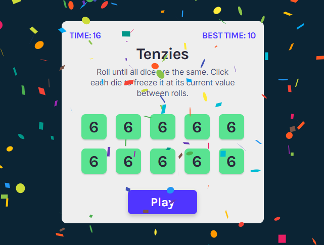

## Tenzies

This is a dice game I built during Bob Ziroll's _React basics_ course from [_The Frontend Developer Career Path_](https://scrimba.com/learn/frontend) on Scrimba.

I have added these extra features:

- displayed timer and user's best time in seconds
- saved recent times including the best time to localStorage

## Live site:

[https://double-vee.github.io/react-tenzies](https://double-vee.github.io/react-tenzies)

## To run the app in the development mode:

1. Clone the repo
2. In the project directory, run `npm i && npm start`
